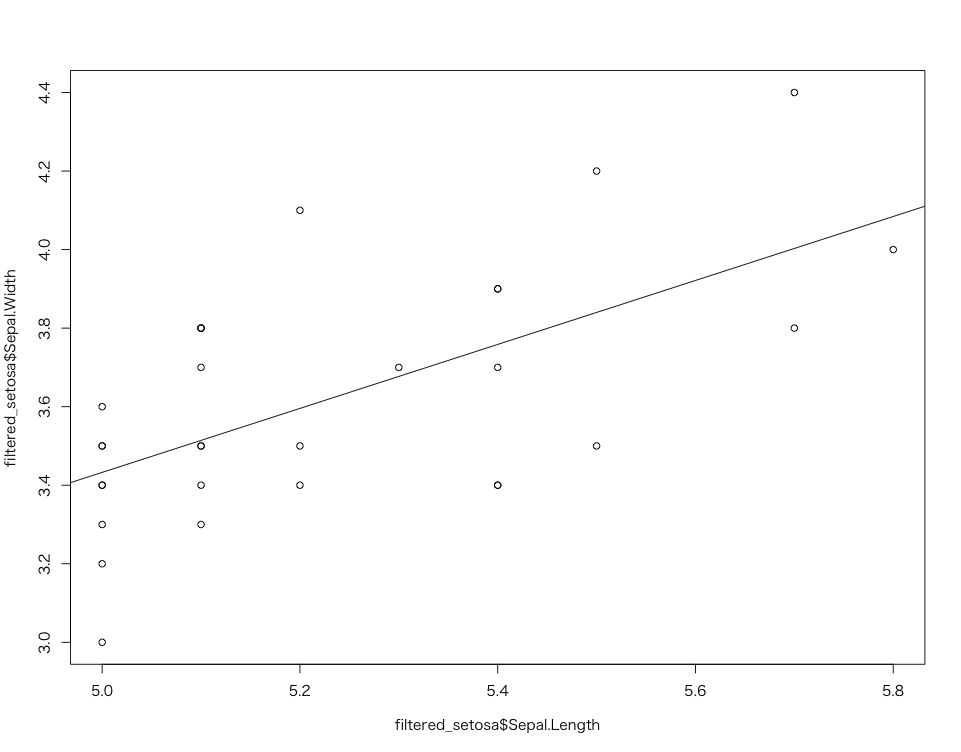
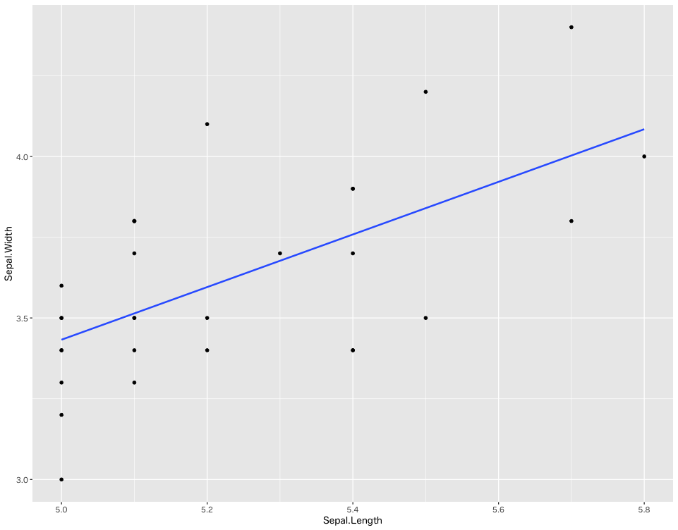

# Tidyverse

## お題

* iris データセットから以下の条件に従いデータを抽出する
  + `Species` が `setosa`
  + `Sepal.Length` が `5.0` 以上
* 抽出したデータセットを使って、以下のグラフを描画する
  + 散布図
  + 回帰直線

## Base R

```r
setosa <- iris[iris$Species == "setosa", ]
filtered_setosa <- setosa[setosa$Sepal.Length >= 5.0, ]
plot(filtered_setosa$Sepal.Length, filtered_setosa$Sepal.Width)
model <- lm(Sepal.Width ~ Sepal.Length, data = filtered_setosa)
abline(model)
```



### Tidyverse

```r
iris |> 
  as_tibble() |>
  filter(Species == "setosa")  |>
  filter(Sepal.Length >= 5.0) |>
  ggplot(mapping = aes(x = Sepal.Length, y=Sepal.Width)) +
  geom_point() + 
  geom_smooth(method="lm", se=F)
```



### 演習問題

* stawarsデータセットから以下の条件に従い、データを抽出してください
  + species が Human
  + heihgt が 180 より大きい
* 抽出したデータセットを使って、以下のグラフを描画する
  + 散布図
  + 回帰直線

<!-- 
starwars |> 
  filter(species == "Human") |>
  filter(height > 180) |>
  ggplot(aes(height, mass)) +
  geom_point() + 
  geom_smooth(method="lm", se=F)
-->
